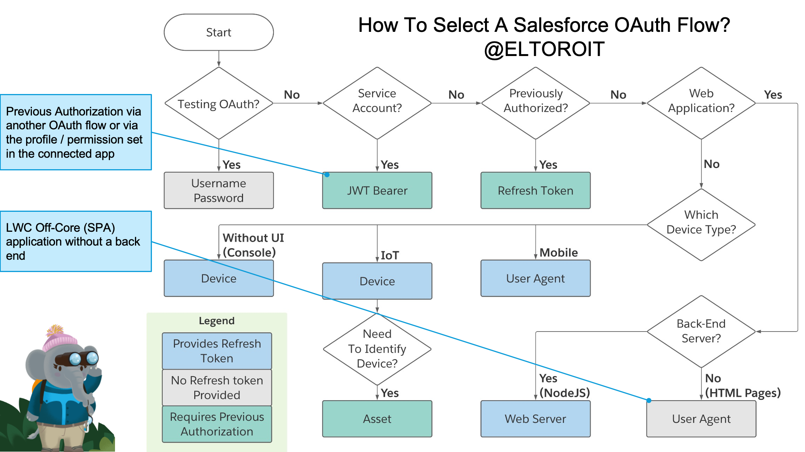
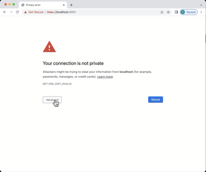

# TL;DR;

[](https://heroku.com/deploy)

# Demystifying OAuth Flows in Salesforce



# Media Links

- [Slides](Slides.ppsx)
- Videos
  - [TDX '21](https://play.vidyard.com/DUVaErx7xZh43UnYkGNCv6)

# Folders

This repo contains few folders:

## Cert

This folder has the certificates that will be used on different places:

- HTTPS server if it's run locally (Heroku has it's own certificates)
- The private key is used in the JWT OAuth flow
- The public key is loaded to the Connected App

**Notes:**

- The private key is loaded via Config Vars (not files) when running in Heroku. This is useful because the code does not need to be deployed if the certificate changes.

## Heroku

- This folder contains the code for the web application demo built with Node.js (back-end) and LWC (front-end).

## Salesforce

- This folder has the metadata needed to create a scratch org for the demo.

# Instructions

1. Clone this repo on your local machine
2. Generate the SSL certificates
3. Open The Salesforce folder in VS Code as a Salesforce project to create and configure the scratch org
4. Create a Heroku app using the Heroku Button

## Clone this repo on your local machine

Cloning this project locally will help you

- Create the SSL certificates
- Create the Salesforce Scratch org

Once the repo is cloned, you can open the Salesforce folder in VS code and create a scratch org. If you also want to execute the web server locally, then open the Heroku project in a separate VS Code window. If you prefer to run the web application in Heroku, then you can use the Heroku button I provide below.

## Generate the SSL certificates

SSL/TLS certificates are used in HTTPS web servers and the JWT OAuth flow. If you are not familiar with SSL certificates and cryptography, I highly recommend you watch these two videos:

- [Public Key Cryptography: RSA Encryption Algorithm](https://www.youtube.com/watch?v=wXB-V_Keiu8)
- [Public key cryptography - Diffie-Hellman Key Exchange](https://www.youtube.com/watch?v=YEBfamv-_do)

They are a bit old, but VERY GOOD!

You may use the certificates that I have included in the repo for the demo, but I highly recommend you create your own certificates for your application. You do not want to use my private key, known by everybody who reads this, in your secure applications.

follow these steps to create your own certificates:

1. Check that you have **openssl** installed by running this command, it should indicate the folder here **openssl** is installed.

```
which openssl
```

2. Create a new folder for the certificates `mkdir MyCerts` and change to it `cd MyCerts`

3. Generate your private key, store the key in a file named **private.key.** You may want to change the password to something a bit more secure (current value is **SomePassword**).

```
openssl genrsa -des3 -passout pass:SomePassword 2048 | openssl rsa -passin pass:SomePassword -out private.key
```

1. Generate a CSR (certificate signing request) using the **private.key** file. The CSR can be sent to a Certificate Authority (CA) to create the public certificate or create your own self-signed certificate.

```
openssl req -new -key private.key -out certificate.csr
```

You will be prompted for some information, this was the information I used to create this file:

```
Country Name (2 letter code) []:CA
State or Province Name (full name) []:ONTARIO
Locality Name (eg, city) []:MARKHAM
Organization Name (eg, company) []:ELTOROIT
Organizational Unit Name (eg, section) []:DEMOS
Common Name (eg, fully qualified host name) []:it.eltoro.www
Email Address []:aperez@salesforce.com

Please enter the following 'extra' attributes
to be sent with your certificate request
A challenge password []:
```

You can see some of this information when you load the certificate in the Connected App in Salesforce, or free online tools like this one: https://www.sslshopper.com/ssl-certificate-tools.html

5. Generate a self-signed digital certificate from the **private.key** and **certificate.csr** files. Store the certificate in a file called **public.crt**

```
openssl x509 -req -sha256 -days 365 -in certificate.csr -signkey private.key -out public.crt
```

**Notes:**

- Since this is a self-signed certificate, when you browse the local web server Chrome is going to give you a security warning. If so, then you may type `thisisunsafe` and it will let you in :-)

<center>

</center>

# Create and configure the Salesforce scratch org

Open the Salesforce project in VS Code.

## If you are running on a Mac...

If you are in a Mac, opne up the terminal window and execute this command:

```
./@ELTOROIT/scripts/shell/CreateOrg.sh
```

## If you are running on a Windows...

For Windows users, you may need these steps (they may be slightly modified):

```
sfdx force:org:create -f config/project-scratch-def.json --setdefaultusername --setalias soDEMO -d 30

sfdx force:source:push --forceoverwrite --json

sfdx force:apex:execute -f ./@ELTOROIT/scripts/shell/../apex/SetUsers.apex --json >> etLogs/apexAfterPush.json

sfdx force:apex:execute -f ./@ELTOROIT/scripts/shell/../apex/SetUsers.apex --json >> etLogs/apexAfterPush.json

sfdx force:source:deploy -p force-apps/doNotDeploy/main/default/profiles/Admin.profile-meta.xml

sfdx ETCopyData:import -c ./@ELTOROIT/data --loglevel info --json --orgsource=soDEMO --orgdestination=soDEMO

sfdx force:apex:test:run --codecoverage --verbose --json --resultformat=json --wait=60

sfdx force:user:password:generate --json

sfdx force:user:display --json
```

## Configuration settings

The end of the script (for Mac) or the last sfdx instruction (for Windows) should display something like this:

```
{
  "accessToken": "00D230000004gLo!AQMAQKXb.IrEl3g.7iivngGoLU6EdkoiMk7pjeonT49JYQHfMsVya3pkkOPeTm4u0t8Swn8RTlyFtYJGHJKyGx59FkJOeMOB",
  "id": "00523000002hXUbAAM",
  "instanceUrl": "https://data-site-371.my.salesforce.com",
  "loginUrl": "https://CS28.salesforce.com",
  "orgId": "00D230000004gLoEAI",
  "profileName": "System Administrator",
  "username": "test-ndhyp78x26gt@example.com",
  "alias": "soDEMO",
  "password": "i$6cfwceBklgq"
}
```

If you are running the web application locally, you will need to update the `.env` file on the heroku folder. If you are running this application on the Heroku server, you will need to enter this information:

| Configuration         | SFDX                                 | Value                                                                                                       |
| --------------------- | ------------------------------------ | ----------------------------------------------------------------------------------------------------------- |
| OAUTH_UN              | username                             | test-ndhyp78x26gt@example.com                                                                               |
| OAUTH_PW              | password                             | i$6cfwceBklgq                                                                                               |
| OAUTH_LOGIN_URL       | instanceUrl                          | https://data-site-371.my.salesforce.com                                                                     |
| OAUTH_CONSUMER_KEY    | Salesforce connected App             | 3MVG9TYG6AjyhS_IClk1EJdydAg4EiHHwsbwkTaQKiTkcBlO_NpzQkllzOCuGgOhLXY37ETxnRNOZAHtOuiyr                       |
| OAUTH_CONSUMER_SECRET | Salesforce connected App             | AA514E8F7044D39BF2E6D93B2A0C9A58BBF290DCCE84FCBAAFBA636A7EA31715                                            |
| OAUTH_CALLBACK        | https://`domain`/callback            | https://localhost:4001/callback                                                                             |
| OAUTH_AUDIENCE        | https://`test\|login`.salesforce.com | https://test.salesforce.com                                                                                 |
| SERVER                |                                      | Either 'Heroku' or 'local', depending on how you are running this                                           |
| JWT_PRIVATE_JEY       |                                      | Private key in text (only required if running on Heroku)                                                    |
| APP_BASE              |                                      | Please enter 'Heroku', which is the folder name for the Heroku project (only required if running on Heroku) |
| PORT                  |                                      | I am using port '4000' (only required if running on local)                                                  |

There are a few more things that are required to be done manually on the Salesforce org, since it's not part of the deployable metadata. They include:

- On the setup menu, go to `Apps > App Manager`
  - Find the **IandAM** connected app and open it to edit it.
  - If you generated your own certificate, then you must upload the **public.crt** file
  - Make sure the **Enable for Device Flow** checkbox is selected
  - If you are running this application on Heroku (or other server), you will need to add the URL address (**https://`domain`/callback**) on the callback URL
  - Click Save
- On the Setup menu, go to `Security > CORS`
  - `Cross-Origin Resource Sharing (CORS) Policy Settings`
    - Click the **Edit** button
    - Make sure the **Enable CORS for OAuth endpoints** checkbox is selected
    - Click **Save**
  - `Allowed Origins List`
    - If you are running this application on Heroku (or other server), you will need to add the URL address
    - Click the **New** button
    - In the **Origin URL Pattern** type the address of the Heroku app, like `https://YourApp.herokuapp.com`

**Notes:**

- Security CORS settings must be done in the org that you are logging into, not the org where the Connected App is configured.

## Heroku

Use this Heroku button to create a Heroku application

[](https://heroku.com/deploy)

You must set the configuration variables from the information displayed after the scratch org is created (see table above)

**Notes:**

- If you are running the application locally,
  - The HTML files need to be created from the LWC source code using `npm run build:client`
  - The webserver can be started with this command `npm run ELTOROIT_SERVE`
  - Remember to use `https://localhost:4001` instead of **https://127.0.0.1:4001**

# Enhancements...

## Device Flow

- Open iPhone and go to my website (myDevice.com)
- Using Bluetooth, talk to the device (handshake)
- Create a new account (username, phone)
- iPhone asks for WiFi credentials
- iPhone gives the device credentials for Wifi network over bluetooth
- Device establishes internet connection
- Device starts oAuth Device flow with Salesforce
- Device receives Salesforce URL + code
- Device sends URL + code to myDevice.com
- iPhone recieves URL + code from myDevice.com
- iPhone opens a browser on the URL
- myDevice.com sends SMS to iPhone
- User on iPhone accepts code received via SMS (automatically)
- User must login to Salesforce (LastPass)

-- SMS: https://developer.apple.com/news/?id=z0i801mg

## How to use this on Experience cloud?

- https://help.salesforce.com/s/articleView?id=000332032&type=1
