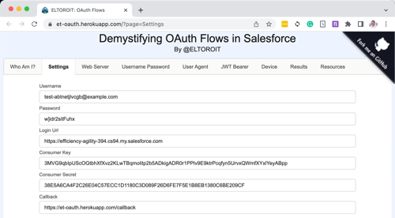

# TL;DR;

[](https://heroku.com/deploy)

# Demystifying OAuth Flows in Salesforce


# Media Links

- [Slides](Slides.ppsx)
- Videos
  - [TDX '21](https://play.vidyard.com/DUVaErx7xZh43UnYkGNCv6)

# Folders

This repo contains few folders:

## Cert

This folder has the certificates that will be used on different places:

- HTTPS server if it's run locally (Heroku has it's own certificates)
- The private key is used in the JWT OAuth flow
- The public key is loaded to the Connected App

**Notes:**

- The private key is loaded via Config Vars (not files) when running in Heroku. This is useful because the code does not need to be deployed if the certificate changes.

## Webserver

- This folder contains the code for the web application demo built with Node.js (back-end) and LWC (front-end).

## Salesforce

- This folder has the metadata needed to create a scratch org for the demo.

# Instructions

1. Clone this repo on your local machine
2. Generate the SSL certificates
3. Create a scratch org
   - Open The Salesforce folder in VS Code as a Salesforce project to create and configure the scratch org
4. Running the web server:
   - Use the Heroku app built for the demo ([click here](https://et-oauth.herokuapp.com/?page=Who%20Am%20I?))
   - Run a Nodejs web server locally (https://localhost:4001)
   - Click [](https://heroku.com/deploy) to create your own Heroku app

## Clone this repo on your local machine

Cloning this project locally will help you

- Create the SSL certificates
- Create the Salesforce Scratch org

Once the repo is cloned, you can open the Salesforce folder in VS code and create a scratch org. If you also want to execute the web server locally, then open the Webserver project in a separate VS Code window. If you prefer to run the web application in Heroku, then you can use the Heroku button provided.

## Generate the SSL certificates

SSL/TLS certificates are used in HTTPS web servers and the JWT OAuth flow. If you are not familiar with SSL certificates and cryptography, I highly recommend you watch these two videos:

- [Public Key Cryptography: RSA Encryption Algorithm](https://www.youtube.com/watch?v=wXB-V_Keiu8)
- [Public key cryptography - Diffie-Hellman Key Exchange](https://www.youtube.com/watch?v=YEBfamv-_do)

They are a bit old, but VERY GOOD!

You may use the certificates that I have included in the repo for the demo, but I highly recommend you create your own certificates for your application. You do not want to use my private key, known by everybody who reads this, in your secure applications.

follow these steps to create your own certificates:

1. Check that you have **openssl** installed by running this command, it should indicate the folder here **openssl** is installed.

```
which openssl
```

2. Create a new folder for the certificates `mkdir Cert` and change to it `cd Cert`

3. Generate your private key, store the key in a file named **private.key.** You may want to change the password to something a bit more secure (current value is **SomePassword**).

```
openssl genrsa -des3 -passout pass:SomePassword 2048 | openssl rsa -passin pass:SomePassword -out private.key
```

4. Generate a CSR (certificate signing request) using the **private.key** file. The CSR is used to generate a certificate, you could either send it to a Certificate Authority (CA) to create a signed certificate or you can create your own self-signed certificate. In either case, you are going to need a CSR, so let's create it:

```
openssl req -new -key private.key -out certificate.csr
```

You will be prompted for some information, this was the information I used to create this file:

```
Country Name (2 letter code) []:CA
State or Province Name (full name) []:ONTARIO
Locality Name (eg, city) []:MARKHAM
Organization Name (eg, company) []:ELTOROIT
Organizational Unit Name (eg, section) []:DEMOS
Common Name (eg, fully qualified host name) []:it.eltoro.www
Email Address []:aperez@salesforce.com

Please enter the following 'extra' attributes
to be sent with your certificate request
A challenge password []:
```

You can see some of this information when you load the certificate in the Connected App in Salesforce, or using free tools online like these ones: https://www.sslshopper.com/ssl-certificate-tools.html, https://ssltools.godaddy.com/views

5. Generate a self-signed digital certificate from the **private.key** and **certificate.csr** files. Store the certificate in a file called **public.crt**

```
openssl x509 -req -sha256 -days 365 -in certificate.csr -signkey private.key -out public.crt
```

**Notes:**

- Since this is a self-signed certificate, when you browse the local web server Chrome is going to give you a security warning. If so, then you may type `thisisunsafe` and it will let you in :-)

<center>


</center>

# Create a scratch org

Create and configure the Salesforce scratch org. First, open the SFDX project in VS Code located in the `Salesforce` folder.

## If you are running on a Mac...

If you are in a Mac, opne up the terminal window and execute this command:

```
./@ELTOROIT/scripts/shell/CreateOrg.sh
```

## If you are running on a Windows...

For Windows users, you may need these steps (they may be slightly modified):

```
sfdx force:org:create -f config/project-scratch-def.json --setdefaultusername --setalias soDEMO -d 30

sfdx force:source:push --forceoverwrite --json

sfdx force:apex:execute -f ./@ELTOROIT/scripts/apex/SetUsers.apex --json >> etLogs/apexAfterPush.json

sfdx force:source:deploy -p force-apps/doNotDeploy/main/default/profiles/Admin.profile-meta.xml

sfdx ETCopyData:import -c ./@ELTOROIT/data --loglevel info --json --orgsource=soDEMO --orgdestination=soDEMO

sfdx force:apex:test:run --codecoverage --verbose --json --resultformat=json --wait=60

sfdx force:user:password:generate --json

sfdx force:user:display --json
```

## Review settings

The end of the script (for Mac) or the last sfdx instruction (for Windows) should display something like this:

```
{
    "accessToken": "00D520000003qKG!ARAAQCoo8FrwTdZ2.muNfIJ.FGp2tN2FlI8iDx3A_P1k7NRI3G5uQOQ1YijfeOqRdLfYeyLPESBlYDRGnn9iheuz7UCDiCSL",
    "id": "00552000006mDtxAAE",
    "instanceUrl": "https://tahoe-lake-2939.scratch.my.salesforce.com",
    "loginUrl": "https://CS170.salesforce.com",
    "orgId": "00D520000003qKGEAY",
    "profileName": "System Administrator",
    "username": "test-pmhvpx6tc3io@example.com",
    "alias": "soDEMO",
    "password": "bGucb5)eegeix"
  }
```

Keep this values handy because you will need them later. If you need to get them back, you can execute `sfdx force:user:display --json`

There are a few more things that are required to be done manually on the Salesforce org, since it's not part of the deployable metadata. They include:

- On the setup menu, go to `Apps > App Manager`
  - Find the **IandAM** connected app and open it to edit it.
  - If you generated your own certificate, then you must upload the **public.crt** file
  - Make sure the **Enable for Device Flow** checkbox is selected
  - If you are running this application on Heroku (or other server), you will need to add the URL address (**https://`domain`/callback**) on the callback URL
  - Click Save


- On the Setup menu, go to `Security > CORS`
  - `Cross-Origin Resource Sharing (CORS) Policy Settings`
    - Click the **Edit** button
    - Make sure the **Enable CORS for OAuth endpoints** checkbox is selected
    - Click **Save**
  - `Allowed Origins List`
    - If you are running this application on Heroku (or other server), you will need to add the URL address
    - Click the **New** button
    - In the **Origin URL Pattern** type the address of the Heroku app, like `https://YourApp.herokuapp.com`

**Notes:**

- Security CORS settings must be done in the org that you are logging into, not the org where the Connected App is configured.

# Running the web server

## Settings

Before you can use the web server to test the scratch org (or any org) you must set the correct values. These are the settings that are required to change:

| Configuration         | SFDX                        | Example                                                                                                               |
| --------------------- | --------------------------- | --------------------------------------------------------------------------------------------------------------------- |
| OAUTH_UN              | username                    | test-ndhyp78x26gt@example.com                                                                                         |
| OAUTH_PW              | password                    | i$6cfwceBklgq                                                                                                         |
| OAUTH_LOGIN_URL       | instanceUrl                 | https://data-site-371.my.salesforce.com (Make sure you use the full `My Domain` for a production or scratch org)      |
| OAUTH_CONSUMER_KEY    | Salesforce connected App    | 3MVG9TYG6AjyhS_IClk1EJdydAg4EiHHwsbwkTaQKiTkcBlO_NpzQkllzOCuGgOhLXY37ETxnRNOZAHtOuiyr                                 |
| OAUTH_CONSUMER_SECRET | Salesforce connected App    | AA514E8F7044D39BF2E6D93B2A0C9A58BBF290DCCE84FCBAAFBA636A7EA31715                                                      |
| OAUTH_CALLBACK        | https://`domain`/callback   | https://localhost:4001/callback (Use https://et-oauth.herokuapp.com/callback if you are not using your own web sever) |
| OAUTH_AUDIENCE        | https://test.salesforce.com | https://test.salesforce.com or https://login.salesforce.com if you are using a production org                         |
| SERVER                | Heroku                      | Either `Heroku` or `local`, depending on how you are running this                                                     |

If you are running your own Heroku app, you will have to set these values too:

| Configuration   | SFDX | Example                                                                |
| --------------- | ---- | ---------------------------------------------------------------------- |
| JWT_PRIVATE_JEY |      | Private certificate key in text format                                 |
| APP_BASE        |      | Please enter 'Heroku', which is the folder name for the Heroku project |

If you are running you own Heroku app, you will have to set these values too:

| Configuration | SFDX | Example                                                                       |
| ------------- | ---- | ----------------------------------------------------------------------------- |
| PORT          | 4000 | The HTTP port number, HTTPS will be one higher (in this case it will be 4001) |

## How to set them?

As mentioned above, there are 3 options you could use:

- Use the Heroku app built for the demo
- Run a Nodejs web server locally
- Click the Heroku button to create your own Heroku app

You need to configure the settings for the web server app, but each o them is done slightly different. Let's review that.

## Use the Heroku app built for the demo

You can [use this Heroku app](https://et-oauth.herokuapp.com/?page=Who%20Am%20I?) to test the settings for your own org, just make sure you set settings in the `Settings` tab to correspond to your org. These settings will not be preserved if you reload the page.

<center>



</center>

## Run a Nodejs web server locally

If you prefer to run this Nodejs app on your own computer, you will need to follow these steps

1. Execute `npm install --global rollup` to install rollup whichis required to compile LWC
2. Execute `npm install` to install the local node dependencies
3. Execute `npm run build:client` to build HTML site from LWC
4. Execute `npm run ELTOROIT_SERVE` to serve the files and run the application
5. Update the `.env` file as described above
   - Note since this file has secured information is never a god idea to add that to a repo (much less a public one) so I have created a file named `OAuth.env` that you can use to clone into a new file named `.env` and save the values there.
6. Open a browser and navigate to `https://localhost:4001`, it's recommended to use localhost instead of 127.0.0.1.

## Click the Heroku button to create your own Heroku app

[](https://heroku.com/deploy) 

The Heroku button can be used to create your own Heroku app. During the creation process, make sure to populate the settings values with the correct information. If you need to change them after the app is created you can go to `Settings` > `Reveal Config Vars` and change them there.
